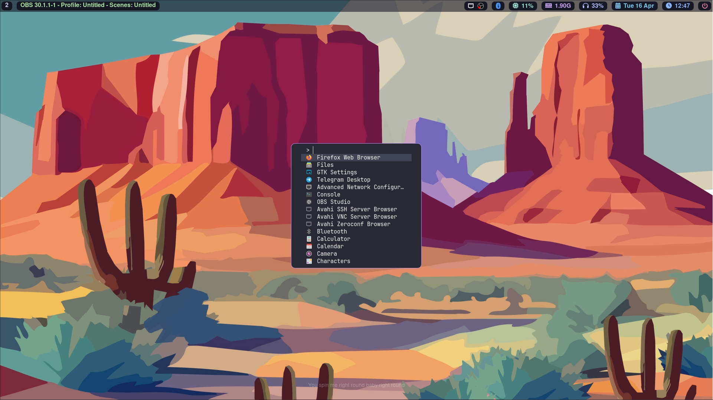
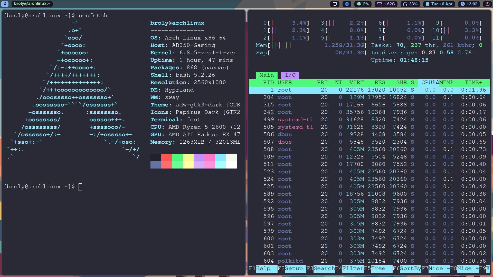

## Disclaimer
**Warning:** This script is tailored for my personal configuration. I cannot be held responsible for any potential system issues or data loss resulting from the use of this script. Proceed with caution and at your own risk.

## Introduction
This script automates the setup process for my personal Arch Linux environment. It is designed for a minimal Arch Linux installation with specific configurations, including display resolution network manager and Pipewire audio setup. While it is primarily intended for use on a minimal Arch Linux setup without a desktop environment, it may also be compatible with other setups, although this has not been extensively tested.

## Automatic Installation

To use the script, follow these steps:

1. Install `wget` if you haven't already:
    ```sh
    pacman -S wget
    ```

2. Download the script:
    ```sh
    wget https://codeberg.org/Broly/hypr_script/raw/branch/master/my-hype.sh
    ```

3. Make the script executable:
    ```sh
    chmod +x my-hype.sh
    ```

4. Run the script:
    ```sh
    ./my-hype.sh
    ```

## Dependencies Installed

The script will automatically install the following dependencies:

- git
- nano
- rust
- hyprland
- waybar
- firefox
- engrampa
- pipewire
- thunar
- thunar-archive-plugin
- gvfs
- wireplumber
- foot
- polkit-gnome
- xdg-desktop-portal-hyprland
- xdg-desktop-portal-gtk
- swaymsg
- pavucontrol
- ttf-font-awesome
- ttf-jetbrains-mono
- qt5-wayland
- qt6-wayland
- nwg-look
- papirus-icon-theme
- qt6-svg
- qt6-declarative

## screenshots
<div style="display: flex; flex-direction: column;">
    
    
</div>
